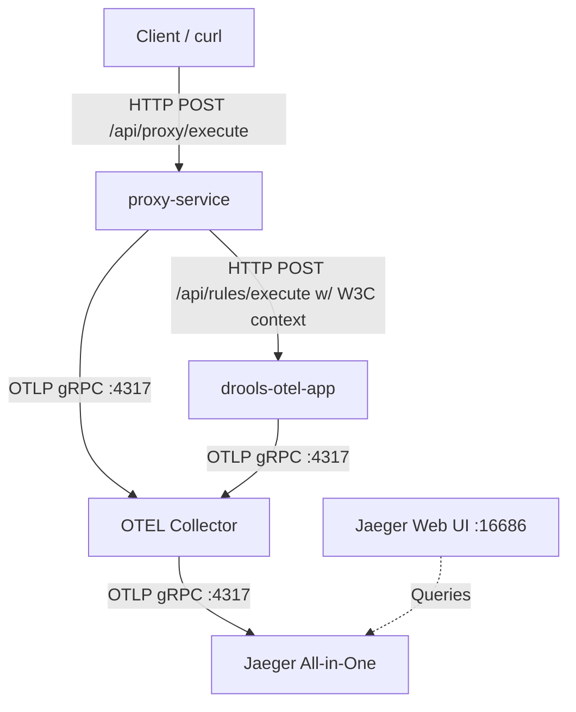

# OpenTelemetry and Jaeger Integration Guide

This skill documents the setup, execution, and verification of the OpenTelemetry (OTEL) and Jaeger integration for the multi-service Spring Boot application featuring Drools.

## User Request Context
The user requested to:
1. Start the application services.
2. Send one request to trigger the execution.
3. Show the trace hierarchy.
4. Set up a second application (the proxy service) to demonstrate distributed trace context propagation across microservices.
5. Create nested child spans in the proxy service before and after calling the downstream Drools service to demonstrate local execution blocks in the trace.
6. Group Drools rules into multiple sequential rule-flow phases (agenda groups: `prepare`, `business-rules`, `customization`, and `post-processing`) to demonstrate phase evaluation tracing using OTel nested spans.

---

## 🛠️ System Architecture & Jaeger Integration

The multi-service observability pipeline consists of:



### 1. Drools Rule-Flow Phases & Agenda Groups
Inside the Drools engine, rules are organized into four agenda-groups in [`discount.drl`](file:///home/pkshrestha/git/otel-spring/src/main/resources/com/example/droolsotel/rules/discount.drl):
* **`prepare`**: Database pre-fetching logic (membership, base discount).
* **`business-rules`**: Core discount engine evaluation (loyalty points, senior/youth age checks).
* **`customization`**: Off-agenda coupon mappings and conflict resolution.
* **`post-processing`**: Totals mapping and coupon applications.

In [`DroolsExecutionService.java`](file:///home/pkshrestha/git/otel-spring/src/main/java/com/example/droolsotel/service/DroolsExecutionService.java), each phase is activated in sequence under its own OpenTelemetry span:
```java
String[] phases = {"prepare", "business-rules", "customization", "post-processing"};
for (String phase : phases) {
    Span phaseSpan = tracer.spanBuilder("drools.phase." + phase).startSpan();
    try (Scope phaseScope = phaseSpan.makeCurrent()) {
        kieSession.getAgenda().getAgendaGroup(phase).setFocus();
        kieSession.fireAllRules();
    } finally {
        phaseSpan.end();
    }
}
```

---

## 🏃 Runbook: Running the Multi-Service Telemetry Flow

### Step 1: Start the Docker Stack
Deploy the services in detached mode:
```bash
docker compose up -d --build
```

### Step 2: Send a Request to the Proxy
Execute a request via the proxy service (port `8081`):
```bash
curl -s -X POST http://localhost:8081/api/proxy/execute \
  -H "Content-Type: application/json" \
  -d @sample-request.json | jq .
```

### Step 3: Fetch and Visualize Trace
Retrieve the JSON from the Jaeger API and run the visualizer formatter script:
```bash
curl -s http://localhost:16686/api/traces/{traceId} > trace.json
python3 format_trace.py trace.json
```

**Formatted Trace Tree Output:**
```text
└── proxy.execute [reqId=req-dummy-04e7ecc3, txId=TX-100223] (839.85 ms)
    ├── proxy.prepare_request [reqId=req-dummy-04e7ecc3, txId=TX-100223] (20.23 ms)
    ├── proxy.http_call_to_drools [reqId=req-dummy-04e7ecc3, txId=TX-100223] (803.34 ms)
    │   └── http post /api/rules/execute (HTTP: POST /api/rules/execute -> 200) (691.89 ms)
    │       └── http.post.rules.execute [reqId=req-dummy-04e7ecc3, txId=TX-100223] (458.60 ms)
    │           └── drools.execution.process (456.82 ms)
    │               └── drools.fireAllRules (236.22 ms)
    │                   ├── drools.engine.evaluate (Phase: agenda_evaluation) (119.30 ms)
    │                   ├── drools.session.insert (18.27 ms)
    │                   └── drools.session.fireAllRulesInternal (217.63 ms)
    │                       ├── drools.phase.prepare (Phase: prepare) (157.37 ms)
    │                       │   ├── drools.rule.Dummy Prepare Rule (7.26 ms)
    │                       │   ├── drools.rule.Fetch Base Tier Discount from Database (39.29 ms)
    │                       │   │   └── db.getTierDiscountPercentage (35.50 ms)
    │                       │   ...
    │                       ├── drools.phase.business-rules (Phase: business-rules) (28.41 ms)
    │                       │   ├── drools.rule.Dummy Business Rule (1.32 ms)
    │                       │   ├── drools.rule.Generate Loyalty Points (2.02 ms)
    │                       │   ├── drools.rule.Process Loyalty Point (2.68 ms)
    │                       │   ...
    │                       ├── drools.phase.customization (Phase: customization) (24.84 ms)
    │                       │   ├── drools.rule.Dummy Customization Rule (1.31 ms)
    │                       │   ├── drools.rule.Generate Bonus Coupon for High Accumulated Discount (1.32 ms)
    │                       │   ...
    │                       └── drools.phase.post-processing (Phase: post-processing) (6.68 ms)
    │                           ├── drools.rule.Dummy Post-Processing Rule (1.12 ms)
    │                           ├── drools.rule.Apply Unused Coupon (2.35 ms)
    │                           ...
    └── proxy.process_response [reqId=req-dummy-04e7ecc3, txId=TX-100223] (15.38 ms)
```
Alternatively, search for traces on the Jaeger UI at `http://localhost:16686`.
