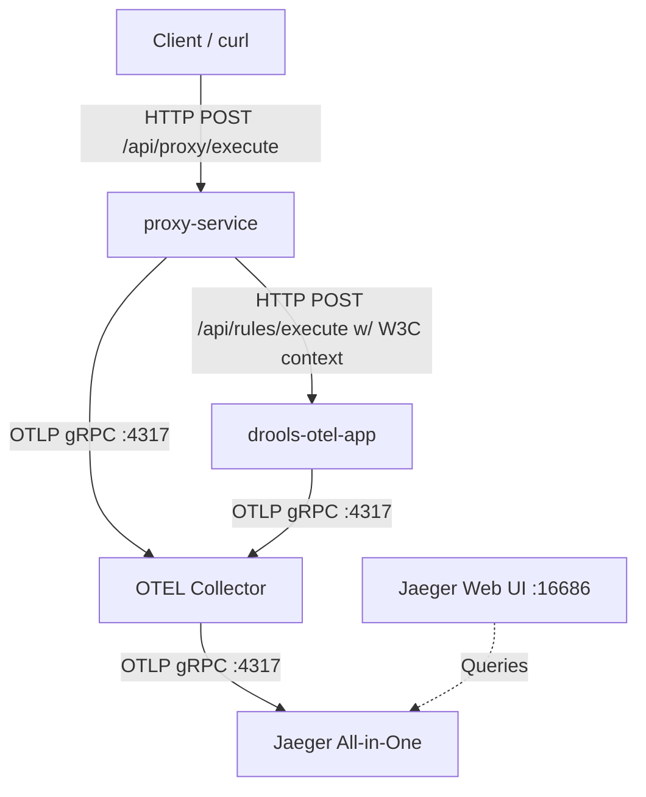

# OpenTelemetry and Jaeger Integration Guide

This skill documents the setup, execution, and verification of the OpenTelemetry (OTEL) and Jaeger integration for the multi-service Spring Boot application featuring Drools.

## User Request Context
The user requested to:
1. Start the application services.
2. Send one request to trigger the execution.
3. Show the trace hierarchy.
4. Set up a second application (the proxy service) to demonstrate distributed trace context propagation across microservices.
5. Create nested child spans in the proxy service before and after calling the downstream Drools service to demonstrate local execution blocks in the trace.

---

## 🛠️ System Architecture & Jaeger Integration

The multi-service observability pipeline consists of:



### 1. Local & Propagated Spans inside the Proxy Service
The proxy service initializes multiple child spans parented by the main request span (`proxy.execute`) in [`ProxyController.java`](file:///home/pkshrestha/git/otel-spring/proxy-service/src/main/java/com/example/proxy/controller/ProxyController.java):

* **`proxy.prepare_request`**: Runs before the HTTP call (validating payloads, adding metadata).
* **`proxy.http_call_to_drools`**: Traces the outgoing HTTP call. The active trace context is injected into the outgoing headers here to propagate downstream.
* **`proxy.process_response`**: Runs after the call returns (post-processing response data, collecting rule engine statistics).

---

## 🏃 Runbook: Running the Multi-Service Telemetry Flow

### Step 1: Start the Docker Stack
Deploy the services in detached mode:
```bash
docker compose up -d --build
```

### Step 2: Send a Request to the Proxy
Execute a request via the proxy service (port `8081`):
```bash
curl -s -X POST http://localhost:8081/api/proxy/execute \
  -H "Content-Type: application/json" \
  -d @sample-request.json | jq .
```
This returns a payload containing both the Drools execution details and the propagated trace information:
```json
{
  "status": "SUCCESS",
  ...
  "traceId": "be8ef0f36811ffff30d555afdaba1aa0",
  "proxyTraceId": "be8ef0f36811ffff30d555afdaba1aa0",
  "proxySpanId": "39ce6205dff2d6ce"
}
```

### Step 3: Fetch and Visualize Trace
Retrieve the JSON from the Jaeger API and run the visualizer formatter script:
```bash
curl -s http://localhost:16686/api/traces/be8ef0f36811ffff30d555afdaba1aa0 > trace.json
python3 format_trace.py trace.json
```

**Formatted Trace Tree Output:**
```text
└── proxy.execute (642.53 ms)
    ├── proxy.prepare_request (20.91 ms)
    ├── proxy.http_call_to_drools (604.55 ms)
    │   └── http post /api/rules/execute (HTTP: POST /api/rules/execute -> 200) (463.41 ms)
    │       └── http.post.rules.execute (285.15 ms)
    │           └── drools.execution.process (283.56 ms)
    │               └── drools.fireAllRules (138.97 ms)
    │                   ├── drools.engine.evaluate (Phase: agenda_evaluation) (64.25 ms)
    │                   ... [Drools rules execution spans]
    └── proxy.process_response (15.46 ms)
```
Alternatively, search for traces on the Jaeger UI at `http://localhost:16686`.
