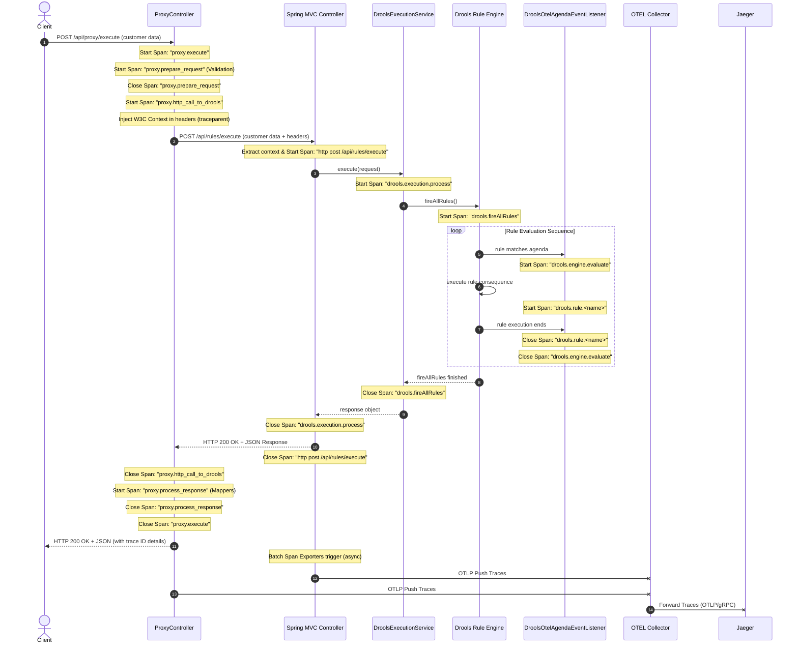

# Architecture & Design: OpenTelemetry + Jaeger Integration

This document explains the architectural decisions behind the multi-service container orchestration setup in [`docker-compose.yml`](file:///home/pkshrestha/git/otel-spring/docker-compose.yml), focusing on trace context propagation, custom nested span lifecycles, and Drools rule-flow phase tracing.

---

## 🏗️ System Architecture

To help visualize how data flows and how ports are exposed, here are diagrams showing both the physical container topology and the logical lifecycle of a single request trace across the microservices.

### 1. Physical Service & Port Topology
This diagram shows how containers communicate on the internal bridge network (`otel-net`) versus what is exposed to the local host machine, incorporating Prometheus and Grafana.

```mermaid
graph TD
    subgraph Host
        Client[Client]
        Browser[Browser]
    end

    subgraph DockerNet
        direction TB
        Proxy[Proxy Service]
        App[Drools App]
        Collector[OTel Collector]
        Jaeger[Jaeger]
        Prometheus[Prometheus]
        Grafana[Grafana]
    end

    Client -->|HTTP Request| Proxy
    Proxy -->|HTTP Request| App
    Browser -->|Access UI| Grafana
    Browser -->|Access UI| Jaeger

    Proxy -->|Export Traces| Collector
    App -->|Export Traces| Collector
    
    Collector -->|Forward Traces| Jaeger
    Collector -->|Expose Metrics| Prometheus
    
    Prometheus -->|Scrape Metrics| App
    Prometheus -->|Scrape Metrics| Collector
    
    Grafana -->|Query Metrics| Prometheus

#### 🖥️ Terminal Unicode Render
```text
 ┌─────────────────────────┐
 │ Host System (Localhost) │
 │                         │
 │ ┌─────────────────┐     │
 │ │  Client / curl  ├─────┼──────────────────────┐
 │ └─────────────────┘     │                      │
 │                         │                      │
 │ ┌─────────────────┐     │                      │
 │ │                 ├─────┼──────────┐           │
 │ │   Web Browser   │     │          │           │
 │ │                 ├─────┼─────┐    │           │
 │ └─────────────────┘     │     │    │           │
 └─────────────────────────┘     │    │           │
                                 │    │           │
 ┌───────────────────────────────┼────┼───────────┼────────────────────────────────────────┐
 │ Docker Network (otel-net)     │    │           │                                        │
 │                               ▼    │           ▼                                        │
 │ ┌──────────────────────────────┐   │   ┌──────────────────────────────┐                 │
 │ │        proxy-service         │   │   │        drools-otel-app       │◄──────────────┐ │
 │ │         (Port 8081)          ├───┼──►│          (Port 8080)         │               │ │
 │ └──────────────┬───────────────┘   │   └──────────────┬───────────────┘               │ │
 │                │                   │                  │                               │ │
 │                │Export Traces      │                  │Export Traces                  │ │
 │                ▼                   │                  ▼                               │ │
 │ ┌──────────────────────────────┐   │   ┌──────────────────────────────┐               │ │
 │ │        otel-collector        │   │   │          prometheus          ├───────────────┘ │
 │ │    (Ports 4317/4318/8889)    │   │   │         (Port 9090)          │                 │
 │ └────────┬──────────────┬──────┘   │   └──────────────▲───────────────┘                 │
 │          │              │          │                  │                               │
 │          │Forward       │Expose    │                  │Scrape Metrics                 │
 │          │Traces        │Metrics   │                  │                               │
 │          ▼              ▼          │                  │                               │
 │ ┌──────────────────────────────┐   │                  │                               │
 │ │            jaeger            │◄──┼──────────────────┘                               │
 │ │         (Port 16686)         │   │                                                  │
 │ └──────────────▲───────────────┘   │                                                  │
 │                │                   │                                                  │
 │                │Query Traces       │                                                  │
 │                │                   │                                                  │
 │ ┌──────────────┴───────────────┐   │                                                  │
 │ │           grafana            │◄──┘                                                  │
 │ │         (Port 3000)          │                                                      │
 │ └──────────────────────────────┘                                                      │
 └───────────────────────────────────────────────────────────────────────────────────────┘
```


### 2. Logical Telemetry Request Flow (Context Propagation & Child Spans)
This diagram details the sequence of execution inside both containers, demonstrating how the trace context is passed via `traceparent` headers to link the spans into a single trace graph, including the local child spans in the proxy service and sequential Drools rule evaluation phases.



#### 🖥️ Terminal Unicode Render
```text
     O
    /|\
    / \                                          ┌───────────────┐                                      ┌─────────────────────┐ ┌──────────────────────┐        ┌──────────────────┐   ┌─────────────────────────────┐ ┌──────────────┐                        ┌──────┐
                                                 │ProxyController│                                      │Spring MVC Controller│ │DroolsExecutionService│        │Drools Rule Engine│   │DroolsOtelAgendaEventListener│ │OTEL Collector│                        │Jaeger│
  Client                                         └───────────────┘                                      └─────────────────────┘ └──────────────────────┘        └──────────────────┘   └─────────────────────────────┘ └──────────────┘                        └──────┘
     ┆ 1: POST /api/proxy/execute (customer data)        ┆                                                         ┆                        ┆                             ┆                           ┆                        ┆                                   ┆
     ────────────────────────────────────────────────────►                                                         ┆                        ┆                             ┆                           ┆                        ┆                                   ┆
     ┆                                                   ┆                                                         ┆                        ┆                             ┆                           ┆                        ┆                                   ┆
     ┆                                    ┌─────────────────────────────┐                                          ┆                        ┆                             ┆                           ┆                        ┆                                   ┆
     ┆                                    │ Start Span: "proxy.execute" │                                          ┆                        ┆                             ┆                           ┆                        ┆                                   ┆
     ┆                                    └─────────────────────────────┘                                          ┆                        ┆                             ┆                           ┆                        ┆                                   ┆
     ┆                                                   ┆                                                         ┆                        ┆                             ┆                           ┆                        ┆                                   ┆
     ┆                         ┌──────────────────────────────────────────────────┐                                ┆                        ┆                             ┆                           ┆                        ┆                                   ┆
     ┆                         │ Start Span: "proxy.prepare_request" (Validation) │                                ┆                        ┆                             ┆                           ┆                        ┆                                   ┆
     ┆                         └──────────────────────────────────────────────────┘                                ┆                        ┆                             ┆                           ┆                        ┆                                   ┆
     ┆                                                   ┆                                                         ┆                        ┆                             ┆                           ┆                        ┆                                   ┆
     ┆                                ┌─────────────────────────────────────┐                                      ┆                        ┆                             ┆                           ┆                        ┆                                   ┆
     ┆                                │ Close Span: "proxy.prepare_request" │                                      ┆                        ┆                             ┆                           ┆                        ┆                                   ┆
     ┆                                └─────────────────────────────────────┘                                      ┆                        ┆                             ┆                           ┆                        ┆                                   ┆
     ┆                                                   ┆                                                         ┆                        ┆                             ┆                           ┆                        ┆                                   ┆
     ┆                              ┌─────────────────────────────────────────┐                                    ┆                        ┆                             ┆                           ┆                        ┆                                   ┆
     ┆                              │ Start Span: "proxy.http_call_to_drools" │                                    ┆                        ┆                             ┆                           ┆                        ┆                                   ┆
     ┆                              └─────────────────────────────────────────┘                                    ┆                        ┆                             ┆                           ┆                        ┆                                   ┆
     ┆                                                   ┆                                                         ┆                        ┆                             ┆                           ┆                        ┆                                   ┆
     ┆                            ┌─────────────────────────────────────────────┐                                  ┆                        ┆                             ┆                           ┆                        ┆                                   ┆
     ┆                            │ Inject W3C Context in headers (traceparent) │                                  ┆                        ┆                             ┆                           ┆                        ┆                                   ┆
     ┆                            └─────────────────────────────────────────────┘                                  ┆                        ┆                             ┆                           ┆                        ┆                                   ┆
     ┆                                                   ┆ 2: POST /api/rules/execute (customer data + headers)    ┆                        ┆                             ┆                           ┆                        ┆                                   ┆
     ┆                                                   ──────────────────────────────────────────────────────────►                        ┆                             ┆                           ┆                        ┆                                   ┆
     ┆                                                   ┆                                                         ┆                        ┆                             ┆                           ┆                        ┆                                   ┆
     ┆                                                   ┆                         ┌──────────────────────────────────────────────────────────────┐                       ┆                           ┆                        ┆                                   ┆
     ┆                                                   ┆                         │ Extract context & Start Span: "http post /api/rules/execute" │                       ┆                           ┆                        ┆                                   ┆
     ┆                                                   ┆                         └──────────────────────────────────────────────────────────────┘                       ┆                           ┆                        ┆                                   ┆
     ┆                                                   ┆                                                         ┆ 3: execute(request)    ┆                             ┆                           ┆                        ┆                                   ┆
     ┆                                                   ┆                                                         ─────────────────────────►                             ┆                           ┆                        ┆                                   ┆
     ┆                                                   ┆                                                         ┆                        ┆                             ┆                           ┆                        ┆                                   ┆
     ┆                                                   ┆                                                         ┆   ┌────────────────────────────────────────┐         ┆                           ┆                        ┆                                   ┆
     ┆                                                   ┆                                                         ┆   │ Start Span: "drools.execution.process" │         ┆                           ┆                        ┆                                   ┆
     ┆                                                   ┆                                                         ┆   └────────────────────────────────────────┘         ┆                           ┆                        ┆                                   ┆
     ┆                                                   ┆                                                         ┆                        ┆ 4: fireAllRules()           ┆                           ┆                        ┆                                   ┆
     ┆                                                   ┆                                                         ┆                        ──────────────────────────────►                           ┆                        ┆                                   ┆
     ┆                                                   ┆                                                         ┆                        ┆                             ┆                           ┆                        ┆                                   ┆
     ┆                                                   ┆                                                         ┆                        ┆           ┌───────────────────────────────────┐         ┆                        ┆                                   ┆
     ┆                                                   ┆                                                         ┆                        ┆           │ Start Span: "drools.fireAllRules" │         ┆                        ┆                                   ┆
     ┆                                                   ┆                                                         ┆                        ┆           └───────────────────────────────────┘         ┆                        ┆                                   ┆
     ┆                                                   ┆                                                         ┆                        ┆                             ┆                           ┆                        ┆                                   ┆
┌────────────────────────────────────────────────────────────────────────────────────────────────────────────────────────────────────────────────────────────────────────────────────────────────────────────────────────────────────────────────────────────────────────┐
│[loop] Rule Evaluation Sequence                                                                                                                                                                                                                                         │
│    ┆                                                   ┆                                                         ┆                        ┆                             ┆ 5: rule matches agenda    ┆                        ┆                                   ┆     │
│    ┆                                                   ┆                                                         ┆                        ┆                             ────────────────────────────►                        ┆                                   ┆     │
│    ┆                                                   ┆                                                         ┆                        ┆                             ┆                           ┆                        ┆                                   ┆     │
│    ┆                                                   ┆                                                         ┆                        ┆                             ┆       ┌──────────────────────────────────────┐     ┆                                   ┆     │
│    ┆                                                   ┆                                                         ┆                        ┆                             ┆       │ Start Span: "drools.engine.evaluate" │     ┆                                   ┆     │
│    ┆                                                   ┆                                                         ┆                        ┆                             ┆       └──────────────────────────────────────┘     ┆                                   ┆     │
│    ┆                                                   ┆                                                         ┆                        ┆                             ┆ 6: execute rule consequence                        ┆                                   ┆     │
│    ┆                                                   ┆                                                         ┆                        ┆                             ┆─────────────────────────────┐                      ┆                                   ┆     │
│    ┆                                                   ┆                                                         ┆                        ┆                             ◄─────────────────────────────┘                      ┆                                   ┆     │
│    ┆                                                   ┆                                                         ┆                        ┆                             ┆                           ┆                        ┆                                   ┆     │
│    ┆                                                   ┆                                                         ┆                        ┆                             ┆         ┌──────────────────────────────────┐       ┆                                   ┆     │
│    ┆                                                   ┆                                                         ┆                        ┆                             ┆         │ Start Span: "drools.rule.<name>" │       ┆                                   ┆     │
│    ┆                                                   ┆                                                         ┆                        ┆                             ┆         └──────────────────────────────────┘       ┆                                   ┆     │
│    ┆                                                   ┆                                                         ┆                        ┆                             ┆ 7: rule execution ends    ┆                        ┆                                   ┆     │
│    ┆                                                   ┆                                                         ┆                        ┆                             ────────────────────────────►                        ┆                                   ┆     │
│    ┆                                                   ┆                                                         ┆                        ┆                             ┆                           ┆                        ┆                                   ┆     │
│    ┆                                                   ┆                                                         ┆                        ┆                             ┆         ┌──────────────────────────────────┐       ┆                                   ┆     │
│    ┆                                                   ┆                                                         ┆                        ┆                             ┆         │ Close Span: "drools.rule.<name>" │       ┆                                   ┆     │
│    ┆                                                   ┆                                                         ┆                        ┆                             ┆         └──────────────────────────────────┘       ┆                                   ┆     │
│    ┆                                                   ┆                                                         ┆                        ┆                             ┆                           ┆                        ┆                                   ┆     │
│    ┆                                                   ┆                                                         ┆                        ┆                             ┆       ┌──────────────────────────────────────┐     ┆                                   ┆     │
│    ┆                                                   ┆                                                         ┆                        ┆                             ┆       │ Close Span: "drools.engine.evaluate" │     ┆                                   ┆     │
│    ┆                                                   ┆                                                         ┆                        ┆                             ┆       └──────────────────────────────────────┘     ┆                                   ┆     │
│    ┆                                                   ┆                                                         ┆                        ┆                             ┆                           ┆                        ┆                                   ┆     │
└────────────────────────────────────────────────────────────────────────────────────────────────────────────────────────────────────────────────────────────────────────────────────────────────────────────────────────────────────────────────────────────────────────┘
     ┆                                                   ┆                                                         ┆                        ┆ 8: fireAllRules finished    ┆                           ┆                        ┆                                   ┆
     ┆                                                   ┆                                                         ┆                        ◄┄┄┄┄┄┄┄┄┄┄┄┄┄┄┄┄┄┄┄┄┄┄┄┄┄┄┄┄┄┄                           ┆                        ┆                                   ┆
     ┆                                                   ┆                                                         ┆                        ┆                             ┆                           ┆                        ┆                                   ┆
     ┆                                                   ┆                                                         ┆      ┌───────────────────────────────────┐           ┆                           ┆                        ┆                                   ┆
     ┆                                                   ┆                                                         ┆      │ Close Span: "drools.fireAllRules" │           ┆                           ┆                        ┆                                   ┆
     ┆                                                   ┆                                                         ┆      └───────────────────────────────────┘           ┆                           ┆                        ┆                                   ┆
     ┆                                                   ┆                                                         ┆ 9: response object     ┆                             ┆                           ┆                        ┆                                   ┆
     ┆                                                   ┆                                                         ◄┄┄┄┄┄┄┄┄┄┄┄┄┄┄┄┄┄┄┄┄┄┄┄┄┄                             ┆                           ┆                        ┆                                   ┆
     ┆                                                   ┆                                                         ┆                        ┆                             ┆                           ┆                        ┆                                   ┆
     ┆                                                   ┆                                    ┌────────────────────────────────────────┐    ┆                             ┆                           ┆                        ┆                                   ┆
     ┆                                                   ┆                                    │ Close Span: "drools.execution.process" │    ┆                             ┆                           ┆                        ┆                                   ┆
     ┆                                                   ┆                                    └────────────────────────────────────────┘    ┆                             ┆                           ┆                        ┆                                   ┆
     ┆                                                   ┆ 10: HTTP 200 OK + JSON Response                         ┆                        ┆                             ┆                           ┆                        ┆                                   ┆
     ┆                                                   ◄┄┄┄┄┄┄┄┄┄┄┄┄┄┄┄┄┄┄┄┄┄┄┄┄┄┄┄┄┄┄┄┄┄┄┄┄┄┄┄┄┄┄┄┄┄┄┄┄┄┄┄┄┄┄┄┄┄┄                        ┆                             ┆                           ┆                        ┆                                   ┆
     ┆                                                   ┆                                                         ┆                        ┆                             ┆                           ┆                        ┆                                   ┆
     ┆                                                   ┆                                  ┌────────────────────────────────────────────┐  ┆                             ┆                           ┆                        ┆                                   ┆
     ┆                                                   ┆                                  │ Close Span: "http post /api/rules/execute" │  ┆                             ┆                           ┆                        ┆                                   ┆
     ┆                                                   ┆                                  └────────────────────────────────────────────┘  ┆                             ┆                           ┆                        ┆                                   ┆
     ┆                                                   ┆                                                         ┆                        ┆                             ┆                           ┆                        ┆                                   ┆
     ┆                              ┌─────────────────────────────────────────┐                                    ┆                        ┆                             ┆                           ┆                        ┆                                   ┆
     ┆                              │ Close Span: "proxy.http_call_to_drools" │                                    ┆                        ┆                             ┆                           ┆                        ┆                                   ┆
     ┆                              └─────────────────────────────────────────┘                                    ┆                        ┆                             ┆                           ┆                        ┆                                   ┆
     ┆                                                   ┆                                                         ┆                        ┆                             ┆                           ┆                        ┆                                   ┆
     ┆                          ┌────────────────────────────────────────────────┐                                 ┆                        ┆                             ┆                           ┆                        ┆                                   ┆
     ┆                          │ Start Span: "proxy.process_response" (Mappers) │                                 ┆                        ┆                             ┆                           ┆                        ┆                                   ┆
     ┆                          └────────────────────────────────────────────────┘                                 ┆                        ┆                             ┆                           ┆                        ┆                                   ┆
     ┆                                                   ┆                                                         ┆                        ┆                             ┆                           ┆                        ┆                                   ┆
     ┆                               ┌──────────────────────────────────────┐                                      ┆                        ┆                             ┆                           ┆                        ┆                                   ┆
     ┆                               │ Close Span: "proxy.process_response" │                                      ┆                        ┆                             ┆                           ┆                        ┆                                   ┆
     ┆                               └──────────────────────────────────────┘                                      ┆                        ┆                             ┆                           ┆                        ┆                                   ┆
     ┆                                                   ┆                                                         ┆                        ┆                             ┆                           ┆                        ┆                                   ┆
     ┆                                    ┌─────────────────────────────┐                                          ┆                        ┆                             ┆                           ┆                        ┆                                   ┆
     ┆                                    │ Close Span: "proxy.execute" │                                          ┆                        ┆                             ┆                           ┆                        ┆                                   ┆
     ┆                                    └─────────────────────────────┘                                          ┆                        ┆                             ┆                           ┆                        ┆                                   ┆
     ┆ 11: HTTP 200 OK + JSON (with trace ID details)    ┆                                                         ┆                        ┆                             ┆                           ┆                        ┆                                   ┆
     ◄┄┄┄┄┄┄┄┄┄┄┄┄┄┄┄┄┄┄┄┄┄┄┄┄┄┄┄┄┄┄┄┄┄┄┄┄┄┄┄┄┄┄┄┄┄┄┄┄┄┄┄┄                                                         ┆                        ┆                             ┆                           ┆                        ┆                                   ┆
     ┆                                                   ┆                                                         ┆                        ┆                             ┆                           ┆                        ┆                                   ┆
     ┆                                                   ┆                                     ┌──────────────────────────────────────┐     ┆                             ┆                           ┆                        ┆                                   ┆
     ┆                                                   ┆                                     │ Batch Span Exporters trigger (async) │     ┆                             ┆                           ┆                        ┆                                   ┆
     ┆                                                   ┆                                     └──────────────────────────────────────┘     ┆                             ┆                           ┆                        ┆                                   ┆
     ┆                                                   ┆                                                         ┆ 12: OTLP Push Traces   ┆                             ┆                           ┆                        ┆                                   ┆
     ┆                                                   ┆                                                         ────────────────────────────────────────────────────────────────────────────────────────────────────────────x                                   ┆
     ┆                                                   ┆ 13: OTLP Push Traces                                    ┆                        ┆                             ┆                           ┆                        ┆                                   ┆
     ┆                                                   ──────────────────────────────────────────────────────────────────────────────────────────────────────────────────────────────────────────────────────────────────────x                                   ┆
     ┆                                                   ┆                                                         ┆                        ┆                             ┆                           ┆                        ┆ 14: Forward Traces (OTLP/gRPC)    ┆
     ┆                                                   ┆                                                         ┆                        ┆                             ┆                           ┆                        ────────────────────────────────────x
     ┆                                                   ┆                                                         ┆                        ┆                             ┆                           ┆                        ┆                                   ┆
```


---

## 🎛️ Drools Rule-Flow Phases & Agenda Groups

To manage complexity and execution order, the business rules are split into four logical phases (agenda groups) evaluated sequentially inside [`discount.drl`](file:///home/pkshrestha/git/otel-spring/src/main/resources/com/example/droolsotel/rules/discount.drl):

1. **`prepare`**: Fetches initial customer information (like membership tier and base discounts) from the HSQL database.
2. **`business-rules`**: Evaluates core discounts (age-based, volume-based, and loyalty point generation).
3. **`customization`**: Calculates special coupons, and handles coupon deduplication and conflict resolution.
4. **`post-processing`**: Applies selected coupons and computes final amounts.

Each phase is explicitly run as a nested span under `drools.session.fireAllRulesInternal` in [`DroolsExecutionService.java`](file:///home/pkshrestha/git/otel-spring/src/main/java/com/example/droolsotel/service/DroolsExecutionService.java):
```java
String[] phases = {"prepare", "business-rules", "customization", "post-processing"};
for (String phase : phases) {
    Span phaseSpan = tracer.spanBuilder("drools.phase." + phase)
            .setAttribute("drools.engine.phase", phase)
            .startSpan();
    try (Scope phaseScope = phaseSpan.makeCurrent()) {
        kieSession.getAgenda().getAgendaGroup(phase).setFocus();
        int fired = kieSession.fireAllRules();
        phaseSpan.setAttribute("drools.rules_fired", (long) fired);
        firedCount += fired;
    } finally {
        phaseSpan.end();
    }
}
```

This generates a clear parent-child structure in Jaeger traces:
```text
  drools.session.fireAllRulesInternal
    ├── drools.phase.prepare
    │     ├── drools.rule.Dummy Prepare Rule
    │     └── drools.rule.Fetch Base Discount from Database
    ├── drools.phase.business-rules
    │     ├── drools.rule.Dummy Business Rule
    │     └── [Core discount rules...]
    ├── drools.phase.customization
    │     ├── drools.rule.Dummy Customization Rule
    │     └── [Coupon rules...]
    └── drools.phase.post-processing
          ├── drools.rule.Dummy Post-Processing Rule
          └── drools.rule.Apply Unused Coupon
```

---

## ❓ Why Use both an OTEL Collector and Jaeger?

You might wonder: *Since `jaegertracing/all-in-one` has its own OTLP receiver (via `COLLECTOR_OTLP_ENABLED=true`), why do we need the standalone `otel-collector` container in the middle?*

While Jaeger can receive raw OTLP traces directly on ports `4317`/`4318`, it lacks the architectural capabilities of a dedicated telemetry gateway. Here is a feature comparison showing what the OpenTelemetry Collector provides that is missing in Jaeger All-in-One:

### OTel Collector vs. Jaeger All-in-One Feature Comparison

| Feature Category | OpenTelemetry Collector | Jaeger All-in-One |
| :--- | :--- | :--- |
| **Supported Telemetry Types** | **Traces, Metrics, and Logs** (all supported via structured pipelines). | **Traces only** (metrics and logs sent here are discarded). |
| **Data Processing & Transformation** | **Yes.** Can filter, rewrite, redact, and add metadata in transit. | **No.** Stores and displays trace data exactly as received. |
| **Tail-Based Sampling** | **Yes.** Can buffer complete traces in memory to sample based on final outcomes (e.g., keep errors, drop 99% of normal traces). | **No.** Supports only head-based sampling (random/probabilistic decisions made before a trace is finished). |
| **Data Redaction & Sanitization** | **Yes.** Can search and strip sensitive PII (passwords, social security numbers) before exporting. | **No.** Telemetry tags are stored without filters. |
| **Multi-Destination Routing** | **Yes.** Can duplicate and route telemetry to multiple backends at once (e.g., Jaeger + Datadog + Elasticsearch). | **No.** Can only write to its own configured trace store. |
| **System Stability (Memory Limiting)** | **Yes.** The `memory_limiter` processor drops telemetry or applies backpressure during load spikes to prevent crashes. | **No.** High traffic volumes can easily cause memory issues and crash the Jaeger container. |

---

### Core Architectural Reasons for the OTel Collector:

### 1. Decoupling & Vendor Neutrality (Production Best Practice)
The application code does not know about Jaeger. It is configured to export telemetry using the standard OpenTelemetry Protocol (OTLP) to a local endpoint (`http://otel-collector:4317`). 
* If you decide to migrate from Jaeger to another backend (e.g., Datadog, Prometheus/Grafana, Honeycomb, or AWS X-Ray), **zero application changes or redeployments** are required. You only change the egress configuration in [`otel-collector-config.yaml`](file:///home/pkshrestha/git/otel-spring/otel-collector-config.yaml).

### 2. Multi-Destination Routing (Multiplexing)
Jaeger is a tracing-only tool. However, an application generates three pillars of observability: Traces, Metrics, and Logs.
* **Standalone Jaeger** cannot store or display metrics and logs. If applications send OTLP logs or metrics directly to Jaeger's OTLP port, they are discarded.
* **The OTEL Collector** acts as a traffic controller:
  * **Traces** are sent to Jaeger and written to the debug console.
  * **Metrics** and **Logs** can be piped to Prometheus, Elasticsearch, Loki, or standard output.

### 3. Pipeline Processing (Batching, Filtering, and Limiting)
The OTEL Collector offers high-performance processing components (like those configured in [`otel-collector-config.yaml`](file:///home/pkshrestha/git/otel-spring/otel-collector-config.yaml)):
* **`memory_limiter`**: Drop telemetry if the collector is running out of memory, protecting the system from crashing under load spikes.
* **`batch`**: Batches traces before exporting them. This drastically reduces network overhead and connection churn compared to sending every span individually from the app.
* **Filter / Redact**: Drop noise (e.g., discard successful health checks `/actuator/health`) or strip sensitive parameters before they leave your network.

### 4. Logging vs. Tracing: Span Events vs. Application Logs
It is critical to distinguish how rule logs and trace events are propagated and visualized:

| Telemetry Type | API/Logging Mechanism | Collector Pipeline | Visible in Jaeger UI Span? |
| :--- | :--- | :--- | :--- |
| **Span Events** | `span.addEvent(...)` | `traces` | **Yes** (rendered inside the span timeline under the "Logs" section) |
| **Application Logs** | SLF4J / DRL `logger.info(...)` | `logs` | **No** (only printed to collector console output in current setup) |

* **Span Events**: Injected directly on active spans inside listeners like [`DroolsOtelRuleRuntimeEventListener`](file:///home/pkshrestha/git/otel-spring/src/main/java/com/example/droolsotel/otel/DroolsOtelRuleRuntimeEventListener.java). Since they are part of the span data structure, they flow through the traces pipeline straight into Jaeger.
* **Application Logs**: Captured by the OpenTelemetry Logback Appender in [`logback-spring.xml`](file:///home/pkshrestha/git/otel-spring/src/main/resources/logback-spring.xml) and sent via the OTel Logs API to the Collector. They are printed to the Collector's debug logs but not routed to Jaeger since standard Jaeger is a tracing-only backend.

---

## 🔗 Trace Context Propagation Mechanics

Distributed Tracing relies on **Trace Context Propagation** to stitch together separate service executions. 

1. **Extracting Incoming Headers**:
   When the Proxy Controller receives a request, it uses `GlobalOpenTelemetry.getPropagators().getTextMapPropagator().extract()` to read W3C headers (specifically `traceparent`). If none are present (e.g., initial client request), it starts a new trace.
2. **Creating Child Spans**:
   The Proxy Controller creates a local span (`proxy.execute`) parented by the extracted context.
3. **Injecting Headers**:
   Before making the outgoing call to the Drools application, it injects the current span context into the HTTP headers of the outgoing call using `getTextMapPropagator().inject()`.
4. **W3C Format Specification**:
   The `traceparent` header propagated downstream looks like:
   `00-be8ef0f36811ffff30d555afdaba1aa0-39ce6205dff2d6ce-01`
   * `00`: Version
   * `be8ef0f36811ffff30d555afdaba1aa0`: Trace ID (shared across all microservices)
   * `39ce6205dff2d6ce`: Parent Span ID (from the Proxy service)
   * `01`: Trace Flags (sampled/recorded)

---

## 🔌 How `docker-compose.yml` Configures the services

Let's look at how the containers interact inside the compose file:

### 1. The Proxy Service (`proxy`)
* **Ports**: Exposes `8081:8081` to the host.
* **Environment**:
  * `OTEL_EXPORTER_OTLP_ENDPOINT=http://otel-collector:4317`
  * `DROOLS_APP_URL=http://drools-otel-app:8080/api/rules/execute`

### 2. The Drools Application (`app`)
* **Ports**: Exposes `8080:8080` to the host.
* **Environment**:
  * `OTEL_EXPORTER_OTLP_ENDPOINT=http://otel-collector:4317`

### 3. The OpenTelemetry Collector (`otel-collector`)
* **Ports**: Exposes `4317` (gRPC), `4318` (HTTP), `8888` (internal metrics), and `8889` (Prometheus metrics exporter) to the network.
* **Flow**: Collects OTLP traces, logs, and metrics from `proxy` and `app`. It generates RED metrics from traces using the `spanmetrics` connector and exports them over Prometheus on port `8889`.

### 4. Jaeger (`jaeger`)
* **Ports**: Exposes `16686` for the Web UI.
* **Flow**: Receives traces from the OTel Collector and allows distributed tracing visualization.

### 5. Prometheus (`prometheus`)
* **Ports**: Exposes `9090` for its UI and query API.
* **Flow**: Periodically scrapes metrics from the Spring Boot actuator (`drools-otel-app:8080/actuator/prometheus`) and OTel trace metrics exposed by the collector (`otel-collector:8889/metrics`).

### 6. Grafana (`grafana`)
* **Ports**: Exposes `3000` for the Web UI.
* **Flow**: Serves as the central dashboard, automatically provisioned to read metrics from Prometheus and traces from Jaeger. Allows cross-referencing metrics with trace IDs.
